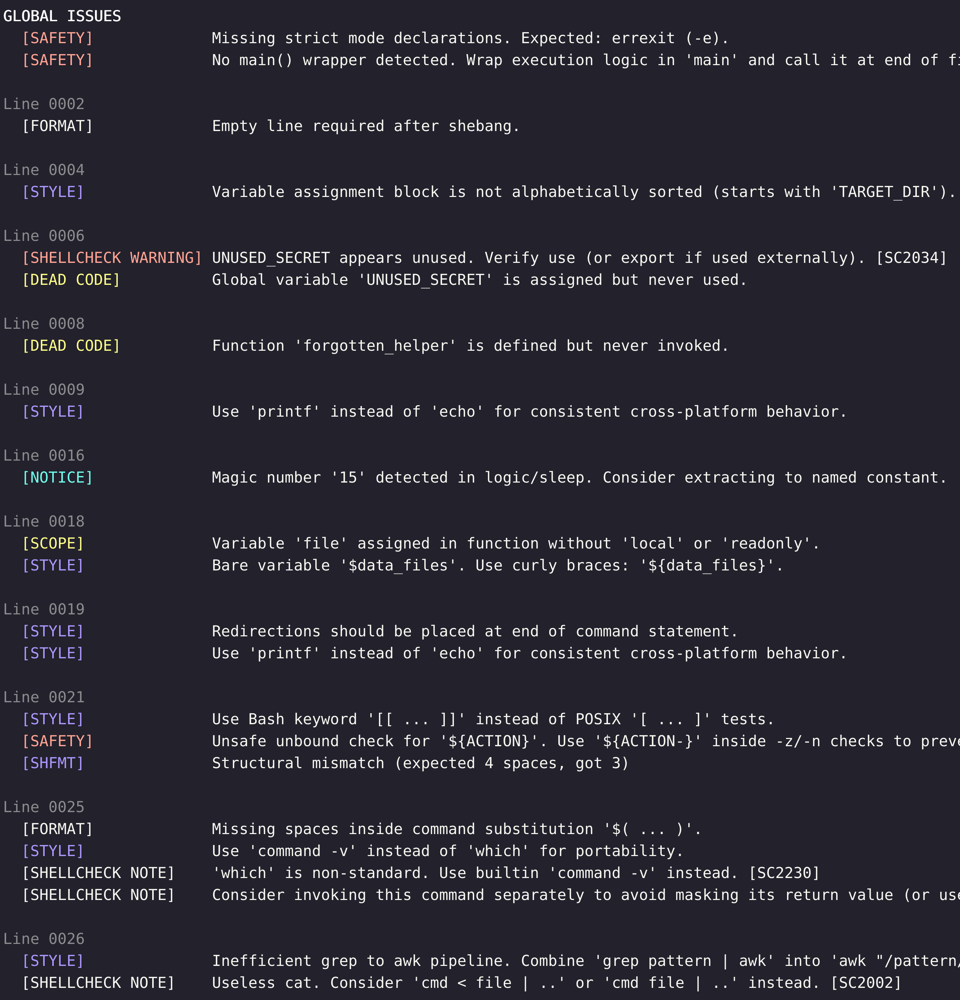

# Shellens: A Better Linter for Bash and Shell

## Why Shellens? (...if you already use ShellCheck and shfmt)

Because standard tools only check *syntax*. Shellens enforces **architecture**.

Shellens is a high-level static analysis engine designed to stop script rot. **It natively wraps `shfmt` and `shellcheck`** to handle standard formatting and security basics, and then layers on a powerful, custom-built Python state machine to enforce enterprise-grade defensive programming.

Bash scripts usually start as simple 10-line automations but inevitably mutate into fragile, unmaintainable over 1000 line monoliths. While tools like ShellCheck are incredible for catching syntax errors, they won't tell you that your function has a cyclomatic complexity of 45, or that you have phantom global variables leaking across five different files, or that you forgot to declare a variable as `local` inside a math block.

It goes beyond standard syntax checking to enforce a rigorous architectural philosophy, focusing on strict POSIX compliance, predictable formatting, and visual hierarchy. It acts as the ultimate architectural guardrail for both your CI/CD pipelines and AI coding assistants, ensuring your scripts remain reliable, modular, free of dead code, and unbreakable as they scale.

<p align="center">
  Example terminal output:</br>
  
</p>

## Features at a Glance

- **AST Analysis Engine:** Uses a robust `tree-sitter` AST (Abstract Syntax Tree) to perform structural parsing. This perfectly tracks nested scopes, single/double/ANSI C quotes (`$'...'`), deeply nested command substitutions (`$(...)`), and heredocs where standard Regex parsers completely fail. Multi-file parsing is highly optimized via internal AST memory caching to prevent redundant disk I/O.
- **External Tool Orchestration:** Seamlessly wraps `shfmt` (for indentation) and `ShellCheck` (for security), intelligently deduplicating their output to prevent warning spam and filter out noise. Automatically enables all optional ShellCheck rules (`-o all`) unless a `.shellcheckrc` configuration file is found (resolving via script directories, working directory, or home directory), perfectly respecting enterprise configurations.
- **Dead Code & Variable Scope Tracking:** Cross-references function calls and global variable expansions across multiple files to find phantom code.
- **Cyclomatic Complexity:** Mathematically scores functions based on branching logic to prevent unreadable monoliths.
- **CI/CD Ready:** Exits with `1` if any violations are found, instantly failing the pipeline. Shellens operates with a strict "Fail-Fast" validation pass: if any provided file is missing, unreadable, or if an unknown CLI flag is provided, it instantly aborts with an error `1` without performing partial linting. Supports beautiful colorized CLI output.
- **AI/LLM Verification Loop:** Outputs clear, human-readable language detailing exact infractions, making it an ideal guardrail for AI coding assistants. When used in an automated loop, it forces the AI to iterate and verify that every generated line strictly adheres to architectural rules before code is finalized.

## Tooling & Dependencies

- **Python 3** - Core engine
- **tree-sitter & tree-sitter-bash** - Python packages for AST parsing
  - Install with: `pip3 install tree-sitter tree-sitter-bash`
- **[shfmt](https://github.com/mvdan/sh#shfmt)** - Used for base 2-space structural indentation checking
- **[ShellCheck](https://github.com/koalaman/shellcheck#installing)** - Used for deep vulnerability and syntax scanning

*Note: If `shfmt`, `shellcheck`, or the `tree-sitter` bindings are missing from the system, Shellens will intentionally crash and exit with code `1`. This ensures CI/CD pipelines never silently pass due to a missing dependency*

## Installation (System-Wide)

You can keep the `.py` extension on the source file for IDE syntax highlighting, but still run it natively as `shellens` using a symbolic link.

```bash
# 1. Make the script executable
chmod +x /path/to/shellens.py

# 2. Create an extensionless symlink in your local bin (or /usr/local/bin)
ln -s /path/to/shellens.py ~/.local/bin/shellens
```

Ensure `~/.local/bin` is in your `$PATH`

## Usage

Run Shellens against one or multiple shell scripts or directories.

*Note: Directories are recursively traversed for `.sh` and `.bash` files, skipping hidden folders and `node_modules`*

```bash
shellens /path/to/script.sh
shellens main.sh utils.sh config.sh
shellens *.sh
shellens src/
```

### Linting via Standard Input (stdin)

Shellens can natively parse and lint code directly from a pipeline or a redirection by passing the `-` symbol as a file path.

```bash
cat script.sh | shellens -
shellens - < script.sh
shellens - <<< '#!/bin/bash\necho "Hello"'
```

## Development & Testing

To verify functionality before deployment or after making custom modifications, run the included `unittest` suite. The test suite executes nearly 100 functional tests to prevent regressions, automatically runs `flake8` and `pylint` to ensure codebase standards are maintained, and leaves zero artifacts by cleaning up its own generated test files.

```bash
python3 -m unittest discover tests
```

## Philosophy & Customization

Shellens is built to enforce universal **industry best practices** for defensive programming, security, and POSIX compatibility. To achieve complete architectural consistency, it also ships with curated formatting defaults out-of-the-box.

Currently, these structural rules are enforced globally to guarantee a unified codebase standard. A major goal for the next release is the introduction of a `.shellensrc` configuration file, which will allow teams to fine-tune these style preferences to better fit their internal workflows.

## Flags & Options

Shellens operates with a clean default mode to provide high-signal bug catching without being pedantic. You can augment its behavior with the following flags:

- `--strict`: Activates formatting and architectural best practices, enforcing a robust enterprise-grade standard. *Note: All rules governed by this mode are detailed in the **Core Philosophies** section below and explicitly marked with the disclaimer: *Only enforced in --strict mode*
- `--info`: Reveals minor stylistic advice, architectural awareness notices, and refactoring suggestions that are otherwise hidden to reduce terminal noise. *Note: All rules governed by this mode are detailed in the **Core Philosophies** section below and explicitly marked with the disclaimer: *Only shown in --info mode*
- `--markdown`: Generates a Markdown table report (ideal for GitLab/GitHub CI artifacts). ShellCheck warnings are automatically converted to clickable links. This will generate a file named `<script_name>-report.md` (e.g., `main-sh-report.md`) in the current directory. *Note: When this flag is used, the process will intentionally exit with `0` even if issues are found, to ensure the CI pipeline proceeds to the next step and publishes the report artifact*
- `--sh`: Forces Shellens to operate in POSIX `sh` compatibility mode. By default, the Python engine will also automatically detect POSIX mode if the script's shebang is `#!/bin/sh` or references `ash`/`dash`. In POSIX mode, aggressive Bash-only enforcement rules (like banning `[ ... ]` tests) are gracefully disabled to support environments like Alpine Linux. Sourced POSIX scripts (which lack shebangs) should be linted with the `--sh` flag.
- `--no-color`: Strips all ANSI color escape codes from the terminal output. *Note: Shellens automatically strips colors if it detects `sys.stdout` is not an interactive TTY, or if the `NO_COLOR` environment variable is set*

## Core Philosophies & Rulesets

### Battle-Tested

Shellens has been rigorously tested against the most popular, complex, and widely-deployed Bash projects (`acme.sh`, `asdf`, `bash-it`, `bats-core`, `Homebrew`, `nvm`, `pi-hole`, `pure-bash-bible`, `pyenv`, and `tfenv`). The AST engine successfully parses tens of thousands of lines of advanced Bash syntax, while actively discovering hidden scope leaks and safety vulnerabilities that human reviewers (and standard linters) missed in.

### Defensive Programming, Portability & Safety

- **Global Safety Declarations:** Shellens firmly enforces the presence of `set -o errexit`, `set -o nounset`, and `set -o pipefail` (or their short forms `-e`, `-u`).
- **Nounset Safety (`-u`):** Using `set -u` is dangerous if you check the existence of unbound variables. Shellens flags naked variable checks in conditionals (e.g., `[[ -z "${foo}" ]]`) and forces you to use a safe fallback: `[[ -z "${foo-}" ]]`.
- **Suspended Safety Tracking:** Intelligently tracks when `set -e` is temporarily suspended (e.g., inside `if` conditions or `|| true` blocks) and warns if critical functions are invoked without error-handling safety nets `[SC2310]`.
- **Swallowed Exit Codes:** Flags subshells passed directly as arguments to functions, warning that internal command failures will be silently masked `[SC2312]`.
- **Naked Readonly:** Flags `readonly foo` if `foo` is never assigned a value anywhere in the script (including via `read` or `for` loops) and is not explicitly guarded by an expansion check (like `${foo:?}`). This prevents `nounset` crashes.
- **Bash 3.2 / macOS Compatibility:** Actively flags Bash 4.0+ features (`declare -g`, `declare -A`, `mapfile`, `readarray`) and fundamentally incompatible cross-platform commands (like GNU `sed -i`) to ensure robust portability.
- **Command Shadowing:** Warns if user-defined functions shadow standard system binaries (e.g., overriding `ls`).
- **Dangerous Patterns:** Actively flags severe security and stability risks like `eval`, piped curl-to-shell (`curl | bash`), `chmod 777`, `kill -9`, and leftover debug traces (`set -x` / `xtrace`) that can leak CI/CD secrets. *Note: Conditional `set -x` inside `if` statements is intelligently allowed for safe debugging*
- **Magic Number Detection:** Scans for raw numeric literals (like `sleep 10` or `-eq 50`) embedded deep in logic and suggests extracting them into named constants for better maintainability. *Note: Only enforced in `--strict` mode*
- **Background Processes:** Warns about background jobs launched via `&` to ensure they are tracked, polled, or resolved with `wait`. *Note: Only shown in `--info` mode*
- **Dynamic Command Execution:** Flags executing commands from variables (e.g., `${pkg_mgr} install`) which obscures static analysis and poses security risks if variables are manipulated. *Note: Only shown in `--info` mode*

### Styling & Formatting

Shellens enforces consistent **2-space indentation**, delegating the heavy lifting to `shfmt`. However, it implements custom "Intelligent Exception Handlers" to override `shfmt`'s limitations:

- **Intelligent Deduplication:** If the Python engine detects a highly specific formatting error (e.g., inconsistent indentation jump or misaligned closing brace), it will actively suppress `shfmt`'s redundant *Structural mismatch* error for that line.
- **Cascading Case Statements:** Allows `case` patterns to be indented 2 spaces inward, and the code inside them 4 spaces inward (which `shfmt` normally rejects).
- **Line Endings:** Files must use Unix `LF` line endings. `CRLF` is instantly rejected.
- **Trailing Whitespace:** Flagged universally, including after line-continuation backslashes `\`.
- **Semantic Line Length:** Enforces an 80-character maximum line length.
  - *Exceptions:* Comments, URLs (`http://`), `echo`, `printf`, custom `log` commands, and AppleScript (`osascript`) blocks are allowed to exceed this limit to preserve readability. Heredocs are completely exempt. Unbroken long string declarations are entirely exempt.
- **Operator Wrapping:** Enforces that line-wrapped operators (`|`, `&&`, `||`) must appear at the *beginning* of the next line, rather than dangling at the end of the current line.

### Shell Keyword & Purity

- **Ban `echo`:** As it behaves inconsistently across OS environments (e.g., macOS vs GNU). Shellens bans `echo` and enforces the use of `printf`.
- **Consecutive `printf` Merging:** Flags back-to-back `printf` statements and suggests combining them into a single, multi-line `printf` to reduce subshell/I/O overhead.
- **Modern Command Substitution:** Enforces the use of `$( ... )` over legacy backticks `` `...` `` for nested command substitution `[SC2006]`.
- **Useless Use of Cat:** Identifies inefficient `cat file | cmd` piping and suggests direct file redirection `cmd < file` `[SC2002]`.
- **Inefficient grep to awk:** Flags pipelines such as `grep pattern | awk` and suggests `awk "/pattern/"`.
- **Ban Piped while read:** Identifies `cmd | while read` and suggests using `< <( cmd )` to avoid losing variable state in subshells.
- **Ban POSIX `[ ... ]` Tests:** The traditional syntax is fragile and subject to word splitting. Shellens bans `[ ... ]` and enforces the modern Bash keyword `[[ ... ]]`. Automatically suppresses redundant ShellCheck `[SC2292]` warnings. *Note: This is inverted in `--sh` POSIX mode*
- **Safe String Equality:** Enforces the use of the idiomatic `==` operator for string comparison inside Bash `[[ ... ]]` blocks, rather than the POSIX `=` operator.
- **Standard Redirection:** Bans lazy bashisms like `&>` and `>&`. Enforces `> file 2>&1`. Additionally, it forces redirections to the end of command statements to keep reading flow clean.
- **Obsolete Commands:** Bans the usage of `egrep`, `fgrep`, `which`, `let`, and `expr`. Uses standard equivalents (`grep -E`, `command -v`...).
- **Ban Non-POSIX Functions:** Rejects the `function foo()` syntax. Forces `foo() {`. *Note: Only enforced in `--strict` mode*
- **No Trailing Semicolons:** Bans unnecessary semicolons at the end of lines. *Note: Only enforced in `--strict` mode*
- **Clean Terminal Output:** Enforces that terminal output strings (via `printf` or custom loggers) do not end with a trailing period. Ellipses (`...`) are explicitly allowed for loading states. *Note: Only enforced in `--strict` mode*

### Variable Conventions & Scoping

- **Curly Brace Enforcement:** Flags bare variables (`$var`) and demands explicit boundaries (`${var}`).
  - *Exceptions:* Standard bash globals (`$1`, `$?`, `$$`, etc.) and array indices (`arr[$var]`).
- **Quote Safe Variables:** Enforces that all variables susceptible to word-splitting and globbing are safely wrapped in double quotes `[SC2086]`.
- **Unassigned Variable Tracking:** Analyzes execution flow to flag variables that are referenced before they are assigned `[SC2154]`.
- **Reliable Local Scoping:** If a variable is assigned inside a function, it *must* be declared as `local` or `readonly`. The AST correctly captures block-scoped variables within conditional and nested logic.
  - *Exceptions:* Known standard environmental variables (`PATH`, `TZ`, `IFS`).
- **Contiguous Assignment Blocks:** Prevents inserting empty lines inside a block of sequential variable assignments, enforcing grouped assignment lists to maintain visual density and block-level sorting logic. *Note: Only enforced in `--strict` mode*
- **Alphabetical Sorting:** Contiguous blocks of variable assignments (and inline lists like `readonly A B C`) must be sorted alphabetically. *Note: Only enforced in `--strict` mode*
- **Uppercase Naming:** Flags `UPPERCASE` variables to confirm they are intended to be user-configurable constants. *Note: Only shown in `--info` mode*
  - *Exception:* If a variable assignment dynamically references a variable declared earlier in the same block, execution order takes priority and alphabetical sorting is bypassed.

### Architectural Complexity

- **Subshell Monolith Detection:** Flags massive subshells (over 20 lines with complexity >= 2) or highly complex subshells (complexity >= 10) to prevent untracked state encapsulation and inline monoliths.
- **Empty Case Fallbacks:** Requires that the `*)` fallback inside a case statement contains an explicit exit, return, or log command to prevent silent passthroughs. *Note: Only enforced in `--strict` mode*
- **Monolith Functions Detection:** Flags functions that contain more than 50 lines of executable code. *Note: Only shown in `--info` mode*
- **Cyclomatic Complexity:** Counts branching logic (`if`, `elif`, `for`, `while`, `&&`, `||`, `case`) inside functions. If the score exceeds 15, it throws a `[COMPLEXITY]` warning. *Note: Only shown in `--info` mode*
  - *Exception:* The `main()` orchestrator function is exempt from both complexity and length checks.

### Visual Spacing & Parentheses

- **Math Context Variable Expansion:** Inside `(( ... ))`, using `${var}` forces string expansion before math evaluation, risking a crash if the variable is empty. It enforces dropping the `$` (e.g., `(( c == var ))`).
- **Arithmetic Increments:** Suggests replacing string-based math assignments (e.g., `var=$(( var + 1 ))`) with the cleaner, idiomatic Bash arithmetic evaluation `(( var++ ))`.
- **Test Command Syntax:** Identifies malformed condition logic inside test brackets, such as using `=` instead of `==` or confusing string/integer comparison operators `[SC2078]`.
- Enforces breathing room around subshells, arrays, and math context. *Note: Only enforced in `--strict` mode*
  - **Arrays:** `=( ... )`
  - **Subshells:** `$( ... )`
  - **Math:** `$(( ... ))` and `(( ... ))`

### The Hybrid `then` Placement Rule


- **Simple Single-Line `if`:** The `; then` **must** be on the same line to save screen space.
- **Complex Multi-Line `if`:** If the condition spans multiple lines (using `\` or `&&`/`||`), the `then` keyword **must** be placed on its own dedicated line, aligned with the `if`. It cannot share a line with other code.
This rule balances vertical density for simple commands with rigid visual hierarchy for complex architecture: *Note: Only enforced in `--strict` mode*

### Linguistic Comment Formatting

Comments are treated differently depending on where they live in the script. The engine uses a state tracker (`has_seen_code`) to differentiate between the "Front Matter" (top-level documentation) and inline imperative comments.

Once the first line of executable code is seen, the following rules apply to all subsequent comments:

- **Comment Indentation:** Enforces that standard full-line comments perfectly align with the exact indentation of the executable code block they immediately precede.
  - *Closing Block Retention:* If a comment is the last line inside a block (preceding a closing `fi`, `done`, `esac`, `}`, etc.), it must retain the deeper indentation of the code inside the block, rather than falling back to match the shallower closing statement.
  - *Continuation Alignment:* If a full-line comment visually acts as a continuation of a preceding inline comment, its `#` character must perfectly align vertically with the `#` of the inline comment above it, bypassing standard block indentation rules.
- **Exceptions:**
  - ShellCheck compiler directives (`# shellcheck disable=...`) bypass all spacing and grammar rules.
  - Comments starting with recognized bash language logic inside (commented out code).

#### Behind `--strict` flag

- **Imperative Mood:** Comments must act as commands. Shellens bans grammatical articles (`a`, `an`, `the`). (e.g., `# Download file` instead of `# Download the file`).
- **No Trailing Punctuation:** Imperative commands do not end in punctuation (periods `.` or ellipses `...`).
- **Exactly One Empty Line:** Every standalone code comment block must be preceded by exactly one empty line to ensure visual separation from the previous code block. Inline comments (`code # comment`) bypass this rule.
- **Header Blocks vs. Standard Comments:** If a standard comment immediately follows a header block, an empty line is still required between them to maintain visual hierarchy.
- **No Contiguous Blocks:** Prevents stacking multiple comment blocks separated by empty lines with no actual code in between.
- **Header Blocks:** Dividers starting with `#####` must be exactly 80 characters long. They may be preceded by 1 or 2 empty lines. All internal text lines within a header block must begin exactly with `# ` (a hash and a space).

### Embedded Language Safety

- **AWK Injection:** Scans for double-quoted `awk "..."` scripts that contain Bash variables (`$var`). This is an injection risk as variables expand before awk parses them. Forces the use of `awk '...'` and passing variables safely via the `-v` flag.
- **Blind Formatting:** When `shfmt` encounters multi-line strings or embedded `awk` scripts, it goes blind. The Python engine takes over, applying custom heuristics to ensure proper indentation and aligned closing braces `}` inside those blocks.

### Multi-File Dead Code Analysis

When run against multiple scripts, Shellens performs a global two-pass cross-reference using the AST parser:

1. Builds a master list of all globally assigned variables and declared functions.
2. Scans all files for usages (`$var`, `${var}`, `${#var[@]}`, `${!var[@]}`, or function calls).
3. Flags any function or global variable that is defined but never invoked across the entire codebase.

*Note: Variables and functions assigned during an `export` command, and Bash built-ins like `COMPREPLY` or `PS1`, are intentionally tracked as valid external dependencies and are exempt from dead code checks*

## Roadmap

- **`.shellensrc` Configuration:** Allow teams to fine-tune style preferences and toggle rules via a JSON/YAML configuration file.
- **Architectural & State Management Refactor:** Eliminate global state by wrapping the analysis context in a `ShellensAnalyzer` class. This will isolate state per run, facilitating parallel analysis and enabling Shellens to be embedded as a Python library.
- **Modern Packaging:** Introduce `pyproject.toml` and standard package structure (e.g. `src/shellens/`) to make the project easily pip-installable.
- **`FormatVisitor` Breakdown:** Refactor the massive `FormatVisitor` class into smaller, discrete helper functions for better maintainability.
- **Static Typing:** Add PEP 484 Type Hints across the codebase to improve developer experience and catch bugs early with static type checkers.
- **Pre-commit Hook Support:** Provide a native `.pre-commit-hooks.yaml` file so developers can easily integrate Shellens into their git pre-commit workflows.
- **SARIF Output Format (`--format=sarif`):** Support emitting results in SARIF to integrate directly into GitHub Advanced Security and GitLab CI dashboards.
- **Parallel Execution:** Utilize Python's `concurrent.futures` to analyze files in parallel, drastically reducing execution time on large monorepos.
- **IDE Language Server (LSP):** Build an LSP wrapper around Shellens to provide real-time feedback (squiggly lines, hover tooltips) directly inside editors like VSCodium/VSCode as developers type.

## The Limits of Static Analysis

While Shellens accurately models Bash's bizarre scoping rules (including subshells, loops, and math contexts), it is fundamentally a *static analysis* engine. It cannot evaluate code dynamically at runtime. If a script relies on `eval`, dynamically executes variables as commands (e.g. `"${cmd}"`), or constructs function names via runtime reflection (e.g., iterating over `declare -F`), Shellens may miss usages or flag them as dead code. This is an unavoidable mathematical boundary of static analysis. While Shellens actively flags recognizable dynamic patterns (like `eval` or executing variables as commands), it cannot trace every possible form of runtime reflection.
